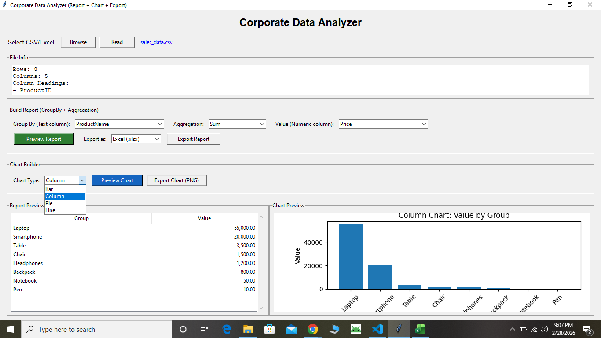

# Corporate Data Analyzer

## Project Description
Corporate Data Analyzer is a desktop-based data analysis application built using Python and Tkinter. 

The application allows users to upload CSV or Excel files, generate grouped summary reports, perform aggregations, and visualize data through charts.

## Key Features
- CSV and Excel file support
- GroupBy and aggregation (Sum, Mean, Max, Min, Count, Median)
- Report preview in table format
- Chart generation (Bar, Column, Line, Pie)
- Export report (Excel / CSV)
- Export chart (PNG)

## Technologies Used
- Python
- Tkinter
- Pandas
- Matplotlib

- ## What This Project Demonstrates

- Data cleaning and preprocessing techniques
- GroupBy and aggregation using Pandas
- GUI application development using Tkinter
- Data visualization integration with Matplotlib
- Report and chart export automation
- Real-world business reporting logic

## How to Run
1. Install Python
2. Install required libraries:
   pip install pandas matplotlib
3. Run:
   python smart_analyzer.py

   ## Application Preview

